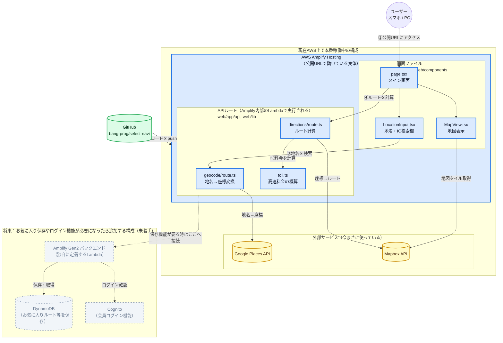

# Select Navi - 技術スタック

## 前提（MVPスコープ）

- 利用者：まずは自分と身内のみ（将来的にユーザーを増やす想定）
- MVP機能：①基本ナビ（目的地検索・ルート表示・案内）／②IC登録による下道自動ルート（乗りたいIC・降りたいICを指定→降りたICから目的地までの下道ルートを自動生成）
- 後回し：③地元民ルート判定（位置情報の集計）、④事故・工事・故障者通報＋周辺通知

## 技術スタック一覧

| 領域 | 採用technology | 備考 |
|---|---|---|
| フロントエンド | Next.js（PWA） | まずはWebアプリとして検証 |
| 地図表示・ルート算出 | Mapbox GL JS / Directions API | 座標が既知の2点間ルート算出には問題なく利用（既存検証コードを踏襲） |
| 位置情報取得 | ブラウザ Geolocation API | ライブラリ選定は別途相談 |
| 音声案内 | Web Speech API（想定） | ライブラリ選定は別途相談 |
| 地名・IC検索（ジオコーディング） | **Google Places API (New) - Text Search** | 詳細は下記「ジオコーディングをGoogleに切り替えた経緯」参照 |
| 高速料金の概算 | 自前実装（NEXCO標準料金式） | 詳細は下記「高速料金表示について」参照 |
| インフラ | AWS Amplify（Gen 2） | ホスティング・API・DB・将来の認証をまとめて管理 |
| API | API Gateway + Lambda | Amplify Gen 2 が内部生成 |
| データベース | DynamoDB | AWSの永年無料枠を活用 |
| 認証（将来） | Cognito | MVP時点では未使用、ユーザー増加時に追加 |
| 実装言語 | TypeScript（フロント・バックエンド共通） | Next.js と Lambda（Amplify Gen 2の`backend.ts`）を同一言語に統一 |

## なぜこの構成にしたか

### Next.js + Mapbox GL JS（フロントエンド）
- 「まずはWebアプリ（PWA）で検証したい」という要望に合致。ネイティブアプリ化は後回しにできる
- Mapboxは既に`test_routing.py`で動作検証済み（ジオコーディング＋Directions APIでIC区間分割ルートの算出に成功している）ため、そのまま踏襲

### AWS Amplify（Gen 2）をインフラに採用
検討した選択肢は3つ：
1. サーバーレス（素のLambda + API Gateway + DynamoDB）
2. 従来型（EC2 + RDS Postgres）
3. **AWS Amplify（採用）**

比較のポイント：

| 観点 | EC2 + RDS | 素のLambda構成 | Amplify |
|---|---|---|---|
| 無料枠 | 12ヶ月限定、その後自動課金 | 主要サービスが永年無料 | 同左（内部はLambda/DynamoDB） |
| 将来のスケール | 自分で構成変更が必要 | 自然にスケールする | 同左 |
| 運用の手間 | OSパッチ・冗長化など管理が必要 | IaC（SAM/CDK）の学習が必要 | CLI/コンソールで一元管理、学習コストが低い |

「将来ユーザーを増やしたいが今は無料枠で運用したい」「運用しやすさを優先したい」という要件から、**内部的にはサーバーレス（Lambda/DynamoDB）の恩恵を受けつつ、運用の手間が最も少ないAmplify**を選択。

### TypeScriptに統一
- Amplify Gen 2はバックエンド定義自体がTypeScript（`amplify/backend.ts`）
- フロントエンド（Next.js）と同じ言語にすることで、一人開発での認知負荷を下げる
- 既存の`test_routing.py`（Python）はMapbox APIを2回呼ぶだけのシンプルなロジックのため、TypeScriptへの移植コストは低い

## ジオコーディングをGoogleに切り替えた経緯

実装後にブラウザで実際に動作確認したところ、Mapbox Geocoding API（v5 `mapbox.places`）が日本の駅名・IC名の検索に弱いことが判明した。「東京駅」のような最も有名な地名で検索しても無関係な場所（川崎市・市川市など）がヒットし、`types=poi`指定や新しいSearch Box APIに変更しても改善しなかった。これはMapboxの日本国内POIデータが薄いことに起因する根本的な限界と判断。

検討した代替案：
1. **Google Places API (New)（採用）** — 駅・IC名の精度が高い。月$200の無料クレジットあり
2. IC検索のみ国交省の無料オープンデータ（国土数値情報）に切替、一般地名はGoogle — 将来的な精度向上策として検討の余地あり
3. Yahoo!ジオコーダAPI（YOLP） — 無料だが駅・IC名などのPOI検索精度はGoogleに劣る可能性

地図表示（Mapbox GL JS）とルート算出（Mapbox Directions API）は座標さえ正しければ問題なく機能するため、そのまま継続。**「地名→座標」の変換だけをGoogleに置き換えるハイブリッド構成**とした。

### Google Maps Platform APIキーの取得手順
1. [Google Cloud Console](https://console.cloud.google.com/)で新規プロジェクトを作成
2. 「APIとサービス」→「ライブラリ」から **Places API (New)** を有効化
3. 請求先アカウント（クレジットカード）を設定（月$200分の無料クレジットあり、個人利用なら基本無料枠内）
4. 「認証情報」からAPIキーを作成し、悪用防止のため「Places API (New)」のみに制限
5. 発行されたキーを `web/.env.local` の `GOOGLE_MAPS_API_KEY` に設定

## 高速料金表示について

高速区間（乗りたいIC→降りたいIC）の通行料金を表示する機能を追加するにあたり、まず正確な料金データを取得できる手段を調査した。

検討した選択肢：
1. **NAVITIME API** — IC間の正確な料金を車種別（5区分）・ETC割引込みで取得できる唯一まともなAPIだが、直接契約が必要な商用APIで、個人開発から即座に使えるものではない
2. **NEXCO公表の標準料金計算式（採用）** — `(距離(km) × 24.6円/km + 150円) × 1.1`（消費税込み、10円単位で丸め）。無料でその場で計算できるが、通常のNEXCO区間にのみ通用する式
3. 高速.jp等の料金検索サイトのスクレイピング — 利用規約上のリスクとサイト構造変化への脆弱性から見送り

**重要な制約**：NEXCO標準式は本州四国連絡高速道路（本四高速、瀬戸大橋・明石海峡大橋・しまなみ海道など）や首都高速・阪神高速のような特殊区間には対応していない。これらの区間は独自の料金体系を持ち、標準式より実際の料金が高くなる傾向がある。実際、動作確認に使っている鳴門IC⇔垂水IC間（本四高速）もこの特殊区間に該当し、画面に表示される金額は実際の料金より低く出る。

このため、料金は**「あくまで目安」であることを画面上に明記した上で**NEXCO標準式による概算値を表示する方針とした。車種区分は普通車を基準（1.0）に、軽自動車等0.8・中型車1.2・大型車1.65・特大車2.75の係数をかけて5区分すべてを算出している（`web/lib/toll.ts`）。

## システム構成図（PM向け）

**色の意味**：🔵青＝今AWS上で実際に動いている部分／🟢緑＝ソースコード管理・自動デプロイの仕組み／🟡黄＝今使っている外部サービス／⬜グレーの点線＝データ保存機能が必要になった時に追加する部分（まだ何も作っていない）

### PMとして押さえておくポイント

- **上段（青＋緑の箱）はすべて実際にAWS上で本番稼働中**。GitHubにpushすると①Amplifyが自動でビルド・デプロイし、公開URL（`https://main.dmm1g4zudj9sa.amplifyapp.com`）で誰でもアクセスできる状態
- **画面ファイルとAPIルートは同じAmplify Hostingの中で動いている**。地名検索やルート計算のAPIルート（`geocode/route.ts`等）も、Amplifyが内部的に管理するLambda上で実行されている（自分たちで個別にLambdaを作ったわけではない）
- **今使っている外部サービスは黄色の2つだけ**：Google（地名検索用）とMapbox（地図表示・ルート計算用）。どちらも自分たちで契約したAPIキーを使っており、悪用防止のためAPIの利用範囲を制限済み
- **下段（点線・グレー）はまだ何も作っていない**。「お気に入りルートの保存」「会員ログイン」のような、データを保存する機能を作る時に初めてAmplify Gen2のバックエンド機能（独自Lambda・DynamoDB・Cognito）を追加する想定
- ユーザーの操作の流れは番号順：①GitHubにpush（開発者の作業）→②ユーザーが公開URLにアクセス→③検索欄に地名を入力→④「ルートを検索」を押す→⑤高速区間なら料金も自動計算

## 未決定・今後相談する事項

- GPS取得・音声案内まわりの具体的なライブラリ選定（ユーザー指示により個別に相談）
- DynamoDBのテーブル設計（IC情報のマスタデータをどう持つか、ユーザーごとのお気に入りルートのキー設計など）
- Mapboxアクセストークンの一段の保護（現状はAmplify環境変数で管理済みだが、ブラウザ用と将来のサーバー専用トークンを分けるかは未対応）
- IC名検索の精度向上（将来的に国交省等のIC一覧オープンデータへの切替を検討）
